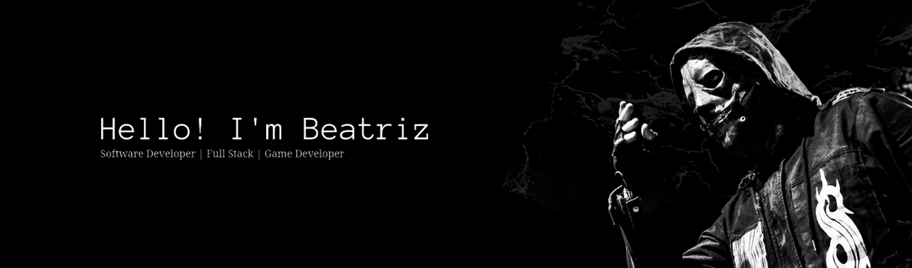

---

 | 

## 💭 **ABOUT ME** 💭

➤ **WHO'S BEATRIZ?**
- Experience in  and a strong interest in **Game Developing**. Worked on projects involving **Full Applications** and enjoy building products that are both technically solid and user-focused. Has background knowlage in Graphic Design, Music Production, Video Editing & StoryTelling.

➤ **CURRENT PROJECTS**
- *Working On:* Finish the Full Stack and Game Developing Roadmaps.
- *Learning:* Database Management (SQL) and Cloud Platforms.
- *Goal:* Get professional on the programming world, network with new people.

➤ **LIKES**
-  Slipknot, C418, Skrillex, fem.love, gingus.
-  Intravenous, Ultrakill, Minecraft, Osu.

## ​⚙️ **TOOLS** ⚙️​​​
​
➤ **PROGRAM LANGUAGES:**

➤ **FRAMEWORKS & TOOLS:**

---

## **HARD SKILLS**

- 📝 Writing maintainable and organized codes
- 💭 Tracking code changes, debugging tools
- ⚙️ Designing technical concepts clearly

## **SOFT SKILLS**

- ☕ Understanding requirements efficiently to avoid rework
- ⚙️ Debugging Persistence on system failures
- 💭 Analytical Thinking on complex problems
- 📝 Clear Documentation Writing

## **OTHER SKILLS**

- ♫ Music Production (FL Studio, Chiptune)
- ♘ Graphic Designer (Websites, Vectors)
- ⌨ Video Editing (SVP 13)
- ✑ Concept Art (Sprites, Illustration, Animation)

## 📨 **LET'S CONNECT!** 📨

   
  

